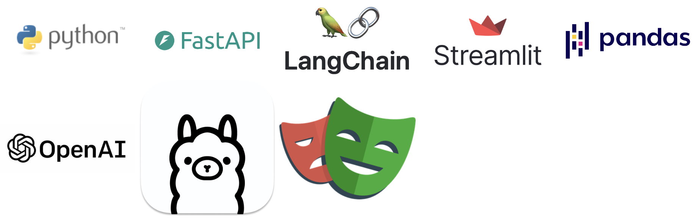
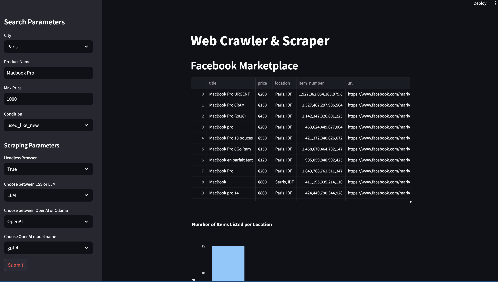

= 🌟 AI Crawler and Scraper of Marketplace - CSS or LLM (OpenAI)

== 🚀 Architecture

image::assets/media/diagram.png[]

=== Backend
A FastAPI consist of accessing posts published in marketplace and return the data to the frontend FastAPI

=== Frontend
A simple streamlit dashboard that allows the user to interact with the backend API
A simple query is sent to the backend then, the data is collected by the backend api, crawler & scraper.
The collected data is saved in a CSV file

== 🧑‍🔬 Run the project

=== Launch the API server:

You need to run the FastAPI server using Uvicorn, a lightning-fast ASGI server. You can do this by executing the following command in your terminal:

    uvicorn main:app --reload

This command will start the FastAPI application defined in the main.py file with hot reloading enabled, which is useful during development as it automatically reloads your application when code changes.

image::./assets/media/README/image_2024-05-02-23-17-59_.png[]

=== Launch the dashboard server:

To run the Streamlit dashboard, use the following command:

    streamlit run dashboard.py

This command starts the Streamlit server with the dashboard defined in dashboard.py, allowing you to interact with the backend API through a user-friendly interface.

== 🖥️ Installation
=== Create and activate a virtual environnement

    python3 -m venv myenv
    source myenv/bin/activate

=== Install python libraries

    pip install requirements.txt

=== Install playwright

    playwright install