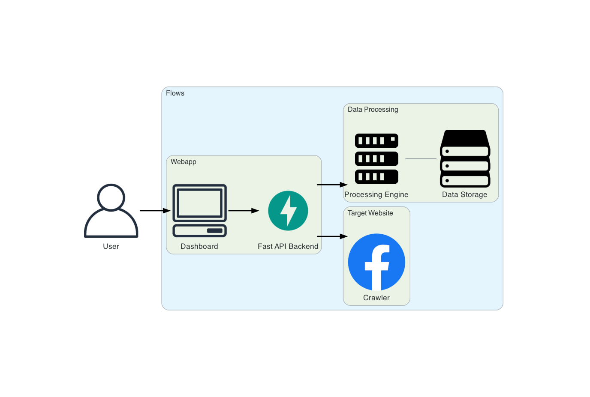
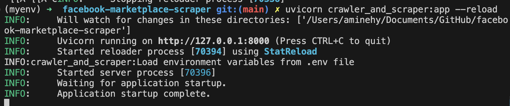

= AI Crawler and Scraper of Marketplace - CSS or LLM (OpenAI)

image::./assets/media/README/image_2024-05-17-13-59-45_.png[]

== 🚀 Architecture

=== Backend
A FastAPI consist of accessing posts published in marketplace and return the data to the frontend FastAPI

=== Frontend
A simple streamlit dashboard that allows the user to interact with the backend API
A simple query is sent to the backend then, the data is collected by the backend api, crawler & scraper.
The collected data is saved in a CSV file

== ✅ Run the project

Launch the API server
....
uvicorn main:app --reload
....

Launch the dashboard server
....
streamlit run dashboard.py
....

image::./assets/media/README/image_2024-05-16-22-44-35_.png[]

