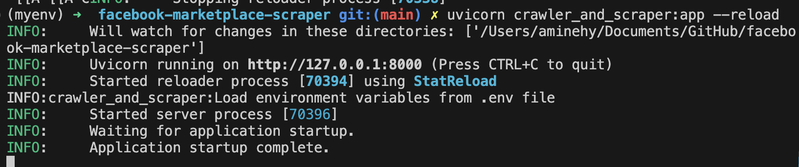

# Crawler and Scraper of Marketplace Post's using CSS or LLM

## Backend

A FastAPI consist of accessing posts published in marketplace and return the data to the frontend FastAPI

## Frontend

A simple streamlit dashboard that allows the user to interact with the backend API

A simple query is sent to the backend then, the data is collected by the backend api, crawler & scraper. The collected data is saved in a CSV file

## Run the project

Launch the API server

    uvicorn main:app --reload

Launch the dashboard server

    streamlit run dashboard.py

