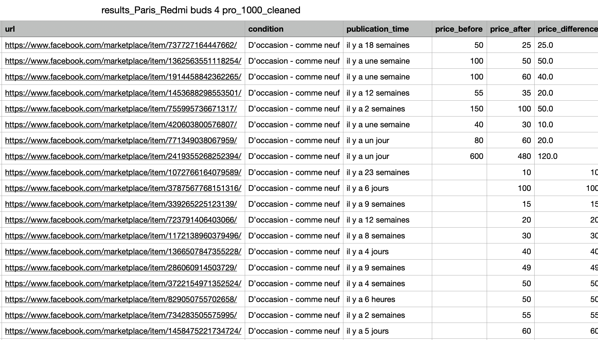
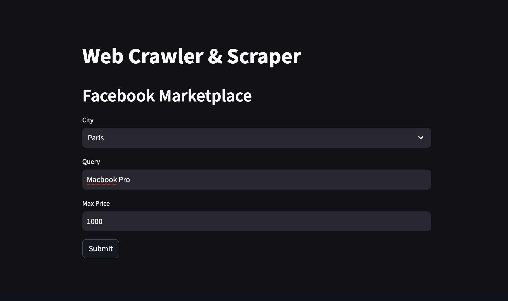

# Crawler and Scraper of Facebook Marketplace Post's

## Backend

A FastAPI consist of accessing posts published in Facebook marketplace and return the data to the frontend FastAPI

## Frontend

A simple streamlit dashboard that allows the user to interact with the backend API

A simple query is sent to the backend then, the data is collected by the backend api, crawler & scraper. The collected data is saved in a CSV file

## Data processing pipeline

This file consist of cleaning and augmenting the data of the CSV file.

## Run the project

Launch the API server

    uvicorn backend_api:app --reload

Launch the dashboard server

    streamlit run dashboard.py

